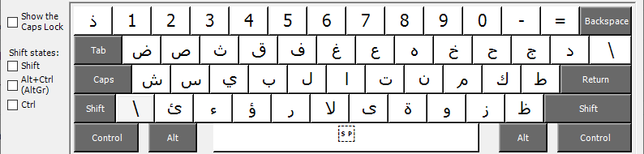

# Custom Arabic keyboard
### Support for additional arabic characters

This keyboard layout is based on a Arabic (Egypt) keyboard and uses the ALT-GR key 
to enter additinal characters.

ALT-GR is the right hand ALT key.

| Character Name           | Arabic character                                          | Key combination (English Keyboard) |
|--------------------------|-----------------------------------------------------------|------------------------------------|
| Dagger Alif              | &#1648;                             | ALT-GR + J                         |    
| Alif Wasla               | &#1649;                             | ALT-GR + H                         |
| Arabic-Indic Digit One   | &#1633;                             | ALT-GR + 1                         |
| Arabic-Indic Digit Two   | &#1634;                             | ALT-GR + 2                         |
| Arabic-Indic Digit Three | &#1635;                             | ALT-GR + 3                         |
| Arabic-Indic Digit Four  | &#1636;                             | ALT-GR + 4                         |
| Arabic-Indic Digit Five  | &#1637;                             | ALT-GR + 5                         |
| Arabic-Indic Digit Six   | &#1638;                             | ALT-GR + 6                         |
| Arabic-Indic Digit Seven | &#1639;                             | ALT-GR + 7                         |
| Arabic-Indic Digit Eight | &#1640;                             | ALT-GR + 8                         |
| Arabic-Indic Digit Nine  | &#1641;                             | ALT-GR + 9                         |
| Arabic-Indic Digit Zero  | &#1632;                             | ALT-GR + 0                         |

The layout is shown in the following screenshots.

Basic layout

Layout, with ALT-GR

