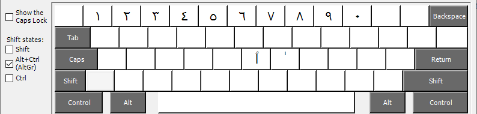

This keyboard layout is based on a Arabic (Egypt) keyboard and uses the ALT-GR key 
to enter additinal characters.

At present, the only additional character it the dagger alif character.

The layout is shown in the following screenshot.

Layout, with ALT-GR

