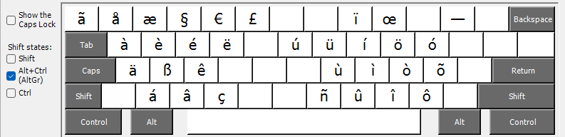
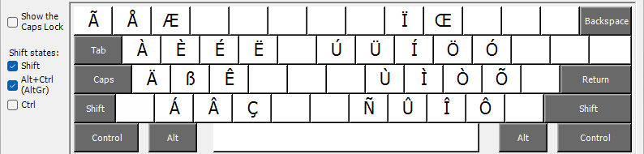

This keyboard layout is based on a US-English keyboard and uses the ALT-GR key 
to enter characters for German, French and Swedish.

The layout is shown in the following screenshots.

Basic layout

Layout, with SHIFT

Layout, with ALT-GR

Layout with ALT-GR and SHIFT

